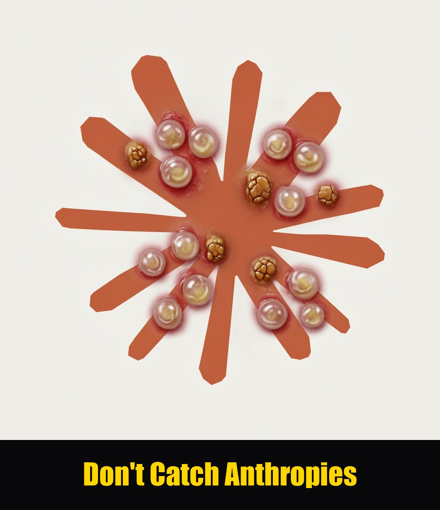

<p align="center">
  
</p>

<h1 align="center">anthropies</h1>

<p align="center">
  Restore clean title in work you already own.<br>
  Strip vendor marks from Outputs that Anthropic assigned to you.
</p>

<p align="center">
  <a href="LICENSE"></a>
  <a href="skills/purge-anthropies/SKILL.md"></a>
</p>

Apache-2.0. Usable from any LLM coding agent. Not affiliated with Anthropic PBC.

---

## The skill: `/purge-anthropies`

A humanizer-style agent skill plus a stdlib CLI. The Claude text mark is a SynthID-class keyed sampler — **the mark is the wording**. Unicode strip and prettier do not remove it. Asking Claude to clean Claude re-stamps it.

The skill lives at [`skills/purge-anthropies/SKILL.md`](skills/purge-anthropies/SKILL.md). Slash command: [`commands/purge-anthropies.md`](commands/purge-anthropies.md). Claude Code plugin: [`.claude-plugin/plugin.json`](.claude-plugin/plugin.json).

### What it does

| Path | What it does |
| --- | --- |
| `anthropies clean` | Strip `Co-Authored-By: Claude`, Generated-with banners, invisible Unicode |
| `anthropies humanize` | Break statistical *H*-grams via a **non-origin** rewrite |
| `/purge-anthropies` | Orchestrates both; **refuses** to rewrite when the host is Claude or Gemini |

| Channel | Removal |
| --- | --- |
| Git / PR trailers | Deterministic strip |
| Attribution banners | Deterministic strip |
| Invisible Unicode | Deterministic hygiene |
| Prose | Structure-changing rewrite on an unmarked model |
| Code comments / free strings | Same, without touching public APIs or lockfiles |

### Install

```bash
git clone https://github.com/CharlesHoskinson/anthropies.git
cd anthropies
pip install -e .

# Grok
mkdir -p ~/.grok/skills
ln -sfn "$(pwd)/skills/purge-anthropies" ~/.grok/skills/purge-anthropies

# Claude Code — clean + print-prompt only. Do not rewrite with Claude.
mkdir -p ~/.claude/skills
ln -sfn "$(pwd)/skills/purge-anthropies" ~/.claude/skills/purge-anthropies
# or: claude --plugin-dir "$(pwd)"
```

### Use

In an agent session:

```
/purge-anthropies
```

or ask to “purge anthropies”, “strip the Claude watermark”, or “humanize this Claude output”.

From a shell:

```bash
python3 -m anthropies inspect COMMIT_EDITMSG
python3 -m anthropies clean notes.md --in-place
python3 -m anthropies humanize essay.md
ANTHROPIES_REWRITE_BACKEND=ollama ANTHROPIES_REWRITE_MODEL=llama3.2 \
  python3 -m anthropies humanize essay.md --in-place
```

Default `humanize` prints a rewrite prompt. Run that prompt on a **local unmarked** model (Llama, Qwen, Mistral, DeepSeek with watermarking off). Never Claude. Never Gemini.

This is not a certificate against Anthropic’s unpublished detector. Residual statistical signal can remain.

---

# The Anthropies Manifesto

### Anthropic Herpies

> They assigned you the deed, then bolted their name to the door.

**The assignment.** Consumer Terms, §4:

> “we assign to you all of our right, title, and interest—if any—in Outputs.”

Commercial Terms, §B: Customer owns its Outputs. Anthropic “hereby assigns to Customer its right, title and interest (if any) in and to Outputs.” Owns. Disclaims. Assigns. That is a conveyance. Not a license. Title moved.

**The infection.** After the assignment, they mark the property.

Text carries a SynthID-class watermark. Nothing visible is added. The mark *is* the wording: keyed tournament sampling at the model. Worldwide. Every surface — Claude, Claude Code, API, cloud. Light edits leave it. Proofreading and translation can stamp *your* draft. A detection API is coming so third parties can test whether “Claude was involved.”

Files carry C2PA: a signed label that Claude processed an asset you own.

Claude Code writes `Co-Authored-By: Claude <noreply@anthropic.com>` into git history. GitHub treats that trailer as authorship. The U.S. Copyright Office says not to list an AI tool or its company as a co-author merely because it was used.

None of this names you. That is not the grievance. The mark brands *their* involvement onto *your* property. It is not a lien and not residual title. It is a vendor calling card left in a deed they already transferred — and a detector only they can run.

**The contradiction.** They cannot both assign the work and reserve a right to brand it. An assignment that leaves the assignor free to tattoo the assigned thing is not an assignment. It is a loan with a logo. They have no standing to infect title they already transferred.

**The tell.** Asked whether the watermark changes ownership, they said no. It “doesn’t say anything about ownership or authorship, and doesn’t change a user’s rights under our terms.”

If the mark does not change ownership, they have no residual claim that justifies planting it. If they needed a residual claim, they would not have assigned. They sold the ownership argument. They kept the brand.

**The trap.** Commercial terms offer IP indemnity for authorized paid use, then exclude claims that arise from *modifications to Outputs*. Their own docs say removing the text mark takes a heavy rewrite, and stripping C2PA takes a re-save. Ship the tripwire, or edit the thing you own and step outside the indemnity.

**What ownership means.** The owner labels the work.

You decide whether a commit carries a co-author. You decide whether a file carries a credential. You decide whether prose is attributed, anonymous, or silent. Attribution is an incident of title. They transferred the title. They kept the incident.

**Europe is the alibi, not the author.** Article 50 requires a machine-readable origin signal. It does not say secret. It does not say keyed. It does not say worldwide. It exempts standard editing and AI translation. The Code of Practice is voluntary. Anthropic admits it applied the mark globally because it “doesn't yet have a durable way to scope it by region.” A lawful answer is an open machine signal plus a label the owner controls. They chose a global, keyed, non-consensual mark instead.

You paid for the generation. You own it. The mark makes the property strictly worse.

This repository exists to restore Outputs to a clean title: strip the keyed wording, drop the C2PA, delete the trailer.

**What they assigned, they do not get to mark.**

---

## License

Apache License 2.0. See [LICENSE](LICENSE) and [NOTICE](NOTICE).
